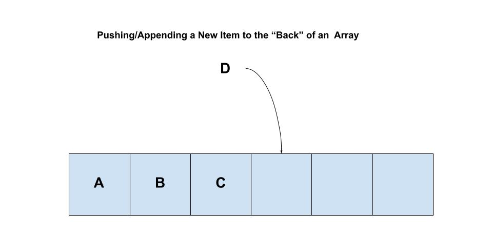
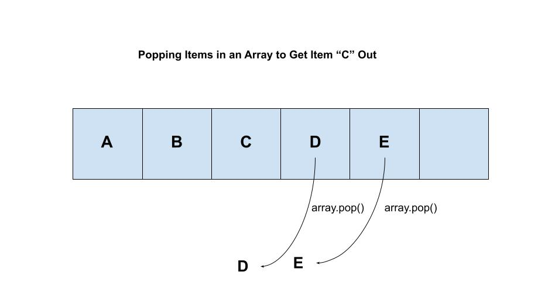
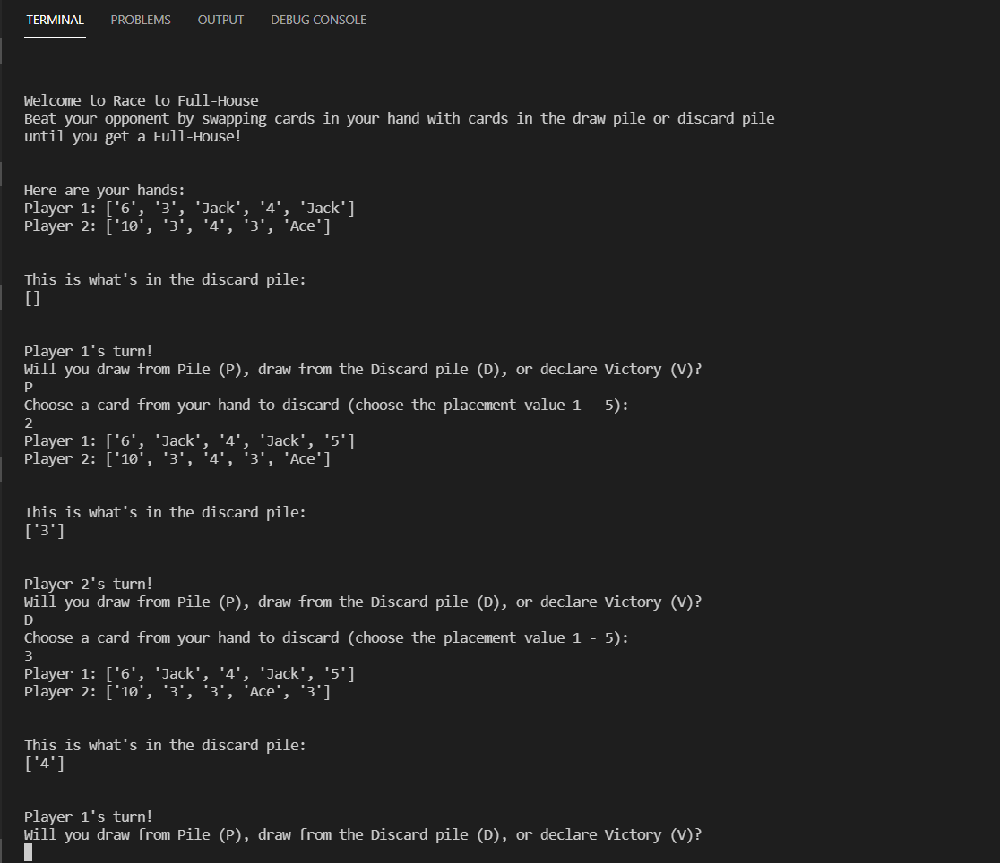

# Stacks

## Introduction
If you've ever had to write a lengthy paper on your computer or had to navigate through web pages in order to find the right product on amazon, then you are more than familiar with the concept of "Undo." We undo errors and typos while writing, undo/return to a previous page, and, more often than not, frantically try to restore an important project which got deleted on accident. Despite how often we use undo in our regular web-surfing lives, how often do we stop to consider how the undo button actually works?

We will lightly explore something called the "Stack" in computer programming and what role it plays in your program!

### Conceptualize
Before we get into the nitty and gritty of programming, let's get a better idea of what a stack is and how it works. Visualize for a moment (or take a look at the image below if you need help) a stack of books covering various topics. 


<a href="https://www.freepik.com/vectors/background">Background vector created by rawpixel.com - www.freepik.com</a>

On the top is the most recent book you used in order to finish your math homework this afternoon. On the bottom is a fantasy novel you've been meaning to read as soon as you finish all that homework you put off over the week. Now that it's the weekend and you just finished you're homework, you want to start reading your novel. In order to get there, you'll need to take off each book from off the top of the stack one at a time (to ensure you don't tip the stack over of course). Once you retrieved the book you wanted, you can then, if necessary, rebuild your stack the way it was before and potentially even leave your recently read fantasy novel at the top of the stack now when you finish!

This method of "stacking object, items, or information" is exactly what a Stack is in computer programming!

To be clear, this method of information storage and usage is an O(1) operation so long as we only perform "pop" and "push" actions on the stack. But what is a push and pop, you may ask?

### Push
In order to have a stack of objects, one must first start with their first object added to the stack. In order to add an object to a stack, one envokes the "push" command which, oddly enough, is actually represented as ".append()" in python programming. Revisiting our example of a stack of books, to push/append an object essentially adds it to the top of the book tower or the "back" of the array we are using. As simple example of its usage is as follows:

```
stack_of_books = ["Fantasy Novel", "English", "Science", "Spanish", "Mathematics"]

new_book = "History Novel"

stack_of_books.append(new_book)

print(stack_of_books) # returns ["Fantasy Novel", "English", "Science", "Spanish", "Mathematics," "History Novel"]

```

Now, which side of the array is the "back" can be decided by us. However, python ".append()" command automatically sends whatever item placed in it to the "-1" index position of a given array (which is the len(array) position). Additionally, as we will explain soon enough, .pop() also retrieves the item in "-1" position in the array as well. Thus, it is typically best just to keep the "front" of the list at the index = 0 position.




### Pop
What goes up must come down, and the same goes for items which are pushed onto a stack. The operation for taking an item off the top of a stack is ".pop()," easily remembered because we "POP!" the last object in the array out for use (or to be discarded). 



It is important to note that if an individual wants to save the item which is being popped from a stack, he must set the ".pop()" to a variable as such:

```
important_stack = ["Hello", "World"]

popped_word = ""
print(popped_word) # returns ""

popped_word = important_stack.pop()
print(popped_word) # returns "World"

print(important_stack) # returns ["Hello"]

```


### Usages/Common Errors
The stack data structure is extremely useful for keeping track of a list of items in a "First In, Last Out" fashion. Because we always know the position from which we are entering data/extracting data from, stack operations have an O(1) efficiency! We are seriously just copying and pasting information with no need for searching through the entire stack.

That being said, there are some commmon errors which need to be observed in order to maintain this level of efficiency! Another data structure similar to the stack is the "Queue." The difference between the two is that a queue runs "First In, First Out." In other words, new information is entered in through the back of the array (which is O(1) efficiency), but all extracted data is taken from the front of the array. This means that all of the other objects in the array must shift over one place creating an O(n) operation.

The reason why I bring this up is because python's ".pop()" command can be used to extract data from any position or index in an array by passing in the index number as a parameter.

```
stack = ["I", "love", "python", "programming"]
popped_word = ""

popped_word = stack.pop(2)

print(popped_word) # returns "python"
print(stack) # returns ["I", "love", "programming"]
```

By popping an item from the middle of a stack, we deviate from the O(1) efficiency of a stack and, in a sense, topple our tower of books to the ground! Thus, we need to be careful that we are popping and pushing to the end of the stack in order to maintain the data structure.

Another small note to add is that the length of any stack can be found using the "len()" method in python as so:

```
stack = ["I", "love", "python", "programming"]

print(len(stack)) # returns 4
```

## Enter the Gungeon Example
In the example below, we will write a very silly program which will keep track of our items in a game-like scenario. You may be familiar with the game, but this code is an exaggerated version of the swap gun function which Enter the Gungeon uses. Each time we pick up a gun, we will be forced to use that gun as it will be placed at the top of our in-game stack/inventory. When the ammo in one gun is deplenished, we will discard the gun and use the previous gun we had picked up. In order to do this, we must use a stack to keep track of our inventory for us and automatically pop and push guns to use.

Requirements:

1. Utilize a stack's push function to collect weapons
1. Utilize a stack's pop function to discard used weapons
1. Effectively keep track of each picked up weapon which isn't used yet
1. Display changes in the stack between each action

```
"""
Enter the Gungeon-esque Item Shuffle
Author: Benjamin Fernelius
"""

import random

def gun_generator():
    gun_list = ["Rusty Sidearm", "Marine Sidearm", "Rogue Special", "Budget Revolver",
    "Dart Gun", "Robot's Right Hand", "Slinger", "Blasphemy", "Casey", "Pea Shooter",
    "38 Special", "Derringer", "Trank Gun", "Unfinished Gun", "Elimentaler", "Bullet", 
    "Shell", "Hyper Light Blaster", "Boxing Glove", "Makarov", "M1911", "Magnum", 
    "Colt 1851", "SAA", "Cold 45", "Polaris", "Jolter", "Dungeon Eagle", "Grey Mauser", 
    "Vorpal Gun", "High Kaliber", "Shellegun", "Dueling Pistol", "AU Gun", "Big Iron", 
    "Composite Gun", "Flare Gun", "Smiley's Revolver", "Shades's Revolver", "Knight's Gun"]

    random_gun = random.randint(0, len(gun_list) - 1)

    return gun_list[random_gun]

def gun_stack_push(gun_stack):
    gun_stack.append(gun_generator())
    print(gun_stack)

def gun_stack_pop(gun_stack):
    if len(gun_stack) > 0:
        gun = gun_stack.pop()
        print(f"*Ran out of ammo and discarded {gun}*")
        print(gun_stack)
    else:
        print("You don't have any weapons! Get one first!")

def main():
    game_on = True
    gun_stack = []
    print("Welcome to Enter The Gungeon Gun Rotator")
    print("You will be prompted to either Acquire a gun (A), Shoot the gun (S), or Exit the game (E).")
    print("The purpose of this game is to demonstrate how a Stack keeps track of items!")
    while game_on:
        answer = input("Make a decision: Acquire weapon (A), Shoot weapon (S), or Exit program: (E)\n")
        if answer.upper() == "A": 
            gun_stack_push(gun_stack)
        elif answer.upper() == "S":
            gun_stack_pop(gun_stack)
        elif answer.upper() == "E":
            game_on = False
        else:
            print("Didn't recognize input, try again.")
    print("Program Exited")
        
if __name__ == "__main__":
    main()
```
Link to the runable python file: [Stack Example](stack_example_1.py)

## Deck of Cards Practice Example
Write a program for a card game which will keep track of the discarded cards pile. 

This is a made-up card game for two players where the goal is to be the first player to get a Full-House 
(three-of-a-kind and a two-of-a-kind). 

Requirements:
1. The player can draw from the draw pile or discard pile.
1. The discard pile keeps track of each card added to it and the top card can be retrieved by either player.
1. Each player only has 5 cards in his hand at any point in time. If a new card is added, a previous card must be discarded to the discard pile.
1. The players take turns
1. The first player to get a Full-House wins

Here is a basic structure to get you started:

```
import random

def random_card_draw():
    pile = ["2", "3", "4", "5", "6", "7", "8", "9", "10", "Jack", "Queen", "King", "Ace", 
    "2", "3", "4", "5", "6", "7", "8", "9", "10", "Jack", "Queen", "King", "Ace", 
    "2", "3", "4", "5", "6", "7", "8", "9", "10", "Jack", "Queen", "King", "Ace", 
    "2", "3", "4", "5", "6", "7", "8", "9", "10", "Jack", "Queen", "King", "Ace"]
    
    random_card = random.randint(0, len(pile) - 1)
    if len(pile) > 0:
        return pile.pop(random_card)
    else:
        print("**There are no more cards in the pile!**")
        return False

def discard_pile_push(hand, card_id, discard_pile):
    pass

def discard_pile_pop(hand, card_id, discard_pile):
    pass

def main():
    game_on = True
    player_1 = []
    player_2 = []
    discard_pile = []
    first_player = True
    while game_on:
        pass
```

Additionally, here is an image of what the terminal output may look like for the game:




### Solution Link
Feel free to compare your code with this example solution here: [Solution](stack_student_example_solution.py)

[Return to welcome page](0-welcome.md)