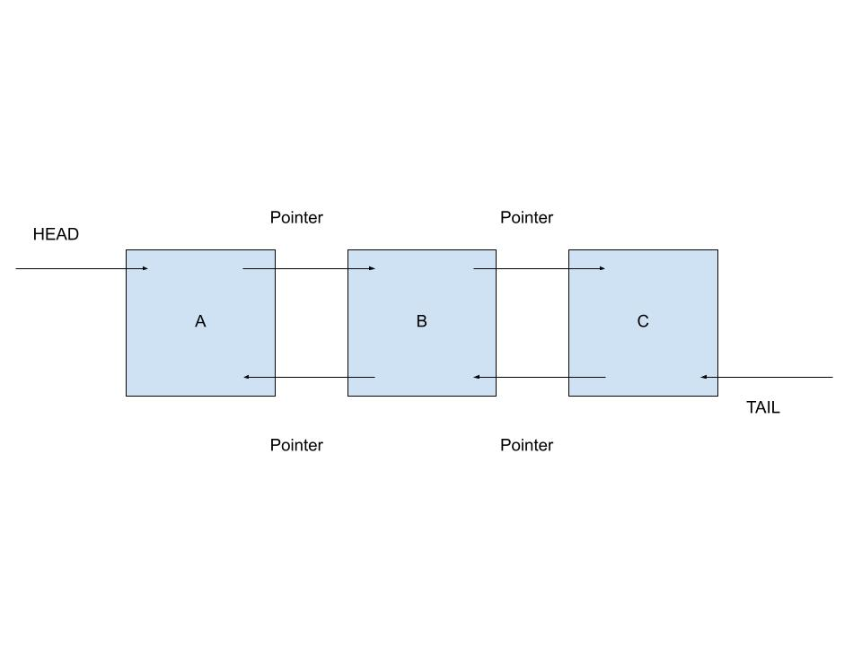
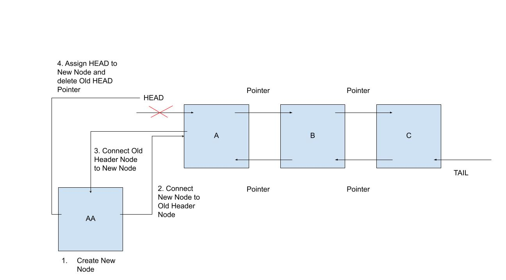
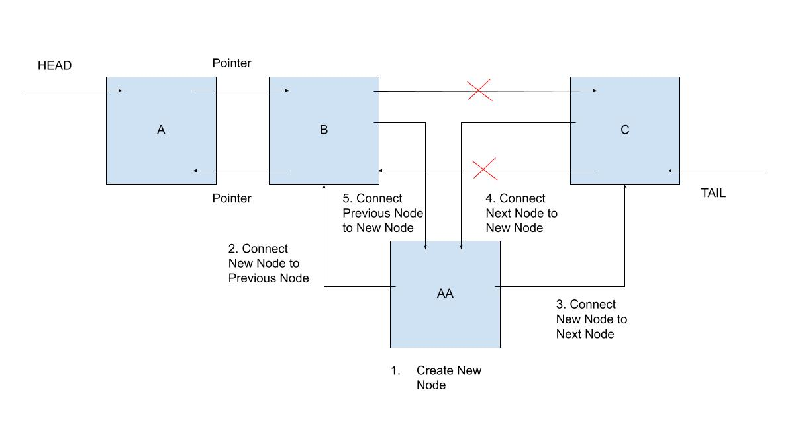
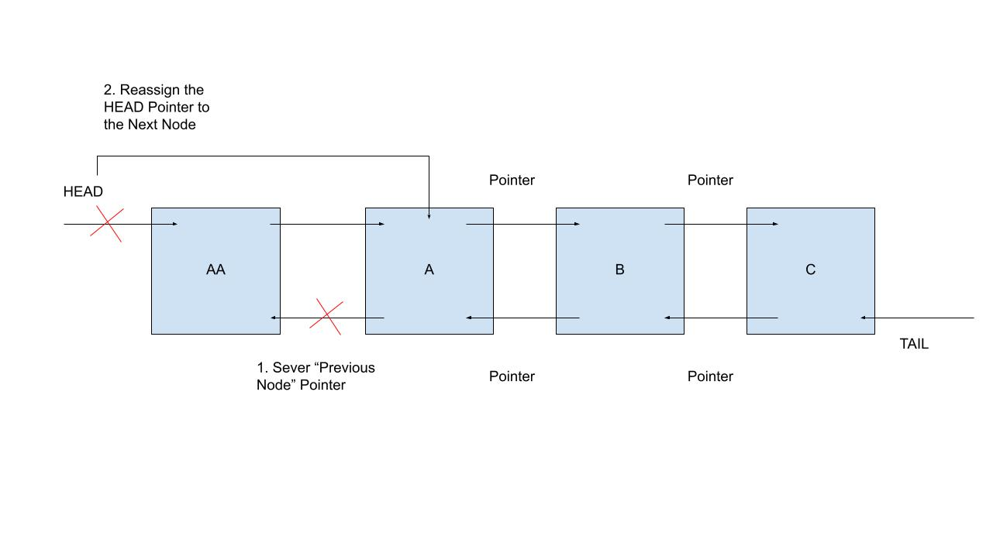
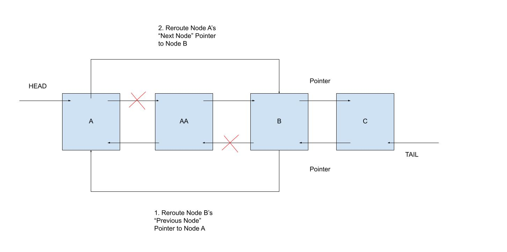
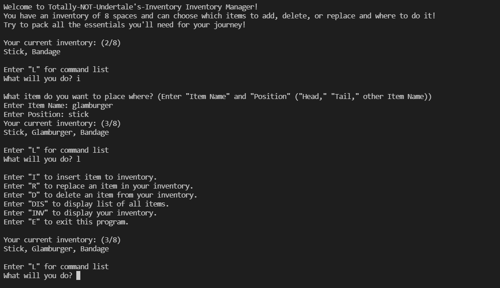

# Linked Lists

## Introduction
Lists and arrays are crucial for programming, but it's hard to get around the fact that they usually have O(n) efficiency due to the nature of having to sort/search through a list or having to move around variables when editing the list size. Luckily, there is a data structure which enables us to add and remove items to a list at a O(1) efficiency all the time (so long as we don't have to iterate through the entire list to do so.) 

In this section we will explore a data structure called the "Linked List" in computer programming and how it can be used to make data organization/management much faster!

### Conceptualize
Before we discuss how to use a linked list, lets take a moment to visualize what a linked list actually is and what it accomplishes. Consider for a moment a normal list/array and how it stores information. An array places information in memory side-by-side and identifies a location in memory based on an index number assigned to each position. When that list is edited, the index number and, often times, memory allocation is changed which takes time to complete.

Now, let's consider an array in which, instead of placing each piece of information side-by-side next to each other, each insertion of information contained the location of the next item and previous item in sequence. By having each item in the list have a pointer to the location in memory of the previous/next item, we can quickly tie together a "Linked List" of information which can be easily generated and edited without going through all the memory hastle a normal list has to deal with. While this may seem a bit counter-productive to deconstruct the list() already available to us in Python, it's important to note that this method of memory assignment allows us to reach O(1) efficiency when assigning new information to the front of end of a linked list! For now, imagine a linked list as being "n" number of nodes which point to one another keeping track everyone's position in the list.


(1976 Spider-Man, Episode 19: "Double Identity"
Image property of Stan Lee and Marvel Comics)


### Head/Tail
In order to create a linked list, we have to learn where to start adding new information! The considering how adding something to the front or end of a linked list is a O(1) operation, programmers have decided to denote these positions as the "Head" and "Tail" of the list, respectively. (Refer to the image below)




When creating a linked list and populating it with your first piece of information, that first insertion simultaneously must create the Head and Tail of the list. So in a sense, a linked list with only one item has a Head and Tail which point to the same node. Once the first piece of information is added, additional information is ideally added via the Head or Tail which preserves the O(1) efficiency of a linked list. We will discuss insertions and how to perform them further in the next subtopic, but keep in mind that every linked list has a Head and Tail which are used to cap both ends of the data structure.


### Insertion
An exceptional feature of a linked list is the ability to insert new information to the Head or Tail of the list using O(1) efficiency, or, if necessary, insert information anywhere in the middle of the list using O(n) efficiency! First things first, how do we insert a new piece of information to the Head/Tail of a linked list?

Assuming the linked list already has a Head and Tail (otherwise the first node would need to be identified as the Head and Tail), we need to perform a specific order of pointer connecting in order to effectively replace the Head/Tail whilst connecting the new node to the linked list chain. If we connect or rename pointers in the wrong order, such as deleting the old Head pointer before connecting the new Head node to linked list, we could accidentally lose the location of memory in our linked list!

So, let's consider connecting a new node to the Head of a linked list for a moment. There is an order of operations performed (as illustrated below) to ensure we do this correctly. First, we must create the new node in memory so we can start making pointers! Second, we must connect the new node to the current Head node's location. Third, we must connect the current Head node to the new node we want to place in the Head position. Lastly, now that the new node is connected completely to the (now) old Head node, we delete the Head pointer and make a new Head pointer pointing towards the new node. Surprisingly enough, this entire operation is nothing more than reassigning pointers and variables which is all an O(1) operation. Essentially, this operation is done instantly in your program!



Considering the operation above, attaching a new node to the Tail of a linked list is the exact same operation, but switching Head for Tail! 

Now, let's take a moment to talk about inserting a new node into the middle of a linked list. Not only is this operation slightly more complicated than attaching to either end of the linked list, but it slows down operation speed (O(n) speed) since we'll need to iterate through the list in order to find which position we'd like to insert the new node into. 

Unlike the lovely four steps we had above, this operation requires five carefully performed steps in order to work. Much like before, we first must create the new node. Second, we need to connect the new node to the previous node. Third, we must connect the new node to the next node in the linked list. (Note, steps two and three can be done in any order). Fourth, we need to connect the next node to the new node. And fifth, we need to connect the previous node to the new node. (Note, steps four and five can be done in any order and the corresponding older pointers may be deleted)



While this operation may not be that difficult to complete, please note that in order to find a location in the middle of a linked list to add a new node, a search must be conducted. Ideally, the user would choose to "insert 'new node' after 'existing node.'" In the example above, the user chose to insert new node "AA" after node "B," thus forcing the program to iterate through each item in the linked list until it found the intended node. This search is an O(n) operation, so be careful!

### Deletion
Deletion is similar to insertion in that typically you'd want to remove the Head or Tail from a Linked List to keep the data structure at an O(1) efficiency, but a user can search through the linked list to delete whatever node they may please at the expense of turning it into an O(n) action. Unlike insertions, however, deleting requires half as many steps and can be implemented vary easily!

In order to delete the Head of a linked list, one must follow two easy steps. Step one, delete the "Previous Node" pointer to sever the Head from the rest of the list. Step two, finish the deal by replacing the Head pointer to skip over the current Head node. By so doing, we have deleted every pointer we have leading to the previous Head node and have assigned a new Head node! Much like insertions, deleting the Tail follows the same two steps except we'll be deleting the "Next Node" and replacing the Tail pointer.



In order to delete a node from the middle of the linked list, we must reroute two pointers to, effectively, skip over the node we want to delete. We can do this in two simple steps! Step one, reroute the Next Node's (the node directly after the node we want to delete) "Previous Node" pointer to the Previous Node instead. Finally, reroute the Previous Node's "Next Node" pointer to the node following the node we want to delete. As we can see in the illustration below, we now skip over the "deleted" node completely and have one less item in our linked list. You may also notice that the deleted node is still pointing to the nodes next to it, and this is perfectly fine. The list itself has lost the location for the deleted node, so it won't appear in our linked list anymore. Beware that deleting from the middle of a linked list requires a search to be conducted which is O(n) efficiency!



### Replace
In comparison to the insertion method and the delete methods mentioned above, replacement is the easiest function to ultilize in a linked list though it is an O(n) action. Inserting into the middle of a linked list and deleting from the middle of a linked list both require the program to conduct a search through (in the worst case scenario) the entirety of the list. Similarly, replacing the value from a linked list, unless you are specifically replacing the Head or Tail nodes, requires you to search through the entire list for the node you which to replace. Referencing the example code below, the user will input an "old value," or value contained within the node we wish to replace, and a "new value" with which we'd like to replace the old value with. The program will compare each node with the old value until the intended node is found and then replaced. This operation offers an efficient alternative if one intends to simultaneous delete an old value and insert a new one by reusing the nodes already linked in the list.

```
def replace(self, old_value, new_value):
        # replaces an existing value with a new one
        curr = self.head
        while curr is not None: 
            if curr.data == old_value: 
                curr.data = new_value 
            curr = curr.next 

```

### Usages/Common Errors
By this point, you may be thinking that linked lists are a lot to swallow all at once and that you'd much rather just use a normal array or list. To that, I'd like to reassure you that a linked list is INCREDIBLY easy to use once its structure is set up! 

As it turns out, linked lists are used in a lot of data storage applications we use on the daily! Next time you shuffle through your playlist on itunes or spotify, take a second to consider just how each of these songs are being referenced, organized, and sorted. That's right, a lot of playlists are built using linked lists due to their effiency in adding to the Head or Tail of lists! 

One common suggestion for when using linked lists is to try and use them for systems in which only the Head and Tail of the list will be edited. While it's not a sin to iterate through a linked list (and is a built in function of linked lists to be able to do), the more you are able to avoid diving into the middle of a linked list, the more you will be operating at O(1) efficiency. So try to set yourself up for success when plannning to use a linked list.

Below are two examples of where you might find linked lists in inventory customization or configuration in video games.

## Yu-Gi-Oh Deck Customization Example

This code demonstrates the uses of Linked Lists by using its structure to organize,
expand, delete, replace, and customize your very own Yu-Gi-Oh deck. Many games
have a function of some sort which enables the player to keep an organized list of times in check,
so this program will demonstrate a potential framework for how those games might work!
The first half of the following program is a typical Linked List (which you may feel free to use in your own example)
and the latter half is what makes this a Yu-Gi-Oh-esque deck builder. Pay close attention to how insert, delete, and replace
can be used in a real program!

Requirements:

1. Utlilze a linked list's function to hold a deck of cards
1. Utilize the insert function to add more cards to the deck
1. Utilize the delete function to be able to remove any item from the deck
1. Utilize the replace function to "exchange" any card from your deck
1. Display inventory when called
1. Be able to exit deck builder program

```
"""
Yu-Gi-Oh-esque Deck Editing/Formation Program
Author: Benjamin Fernelius

"""
import random

# This is the Linked List class. In other words, here is where the magic happens!
class LinkedList:

    class Node: # embedded class Nodes creates and keeps track of each node in our list

        def __init__(self, data):
            
            self.data = data
            self.next = None
            self.prev = None
    
    def __init__(self): # initializes head and tail variables for identification
        self.head = None
        self.tail = None

    def insert_head(self, value):
        # this inserts into the first position/front of the linked list
        new_node = LinkedList.Node(value)

        if self.head is None:
            self.head = new_node
            self.tail = new_node
        else:
            new_node.next = self.head 
            self.head.prev = new_node 
            self.head = new_node 
    
    def insert_tail(self, value):
        # this inserts into the last position/end of the linked list
        new_node = LinkedList.Node(value)

        if self.tail is None:
            self.tail = new_node
            self.head = new_node
        else:
            new_node.prev = self.tail 
            self.tail.next = new_node 
            self.tail = new_node

    def remove_head(self):
        # removes value in head
        if self.head == self.tail:
            self.head = None
            self.tail = None
        elif self.head is not None:
            self.head.next.prev = None 
            self.head = self.head.next
        
    def remove_tail(self):
        # removes value in tail
        if self.tail == self.head:
            self.tail = None
            self.head = None
        elif self.tail is not None:
            self.tail.prev.next = None 
            self.tail = self.tail.prev

    def insert_after(self, value, new_value):
        # inserts new value immediately one position after determined value
        curr = self.head
        while curr is not None:
            if curr.data == value:
                if curr == self.tail:
                    self.insert_tail(new_value)
                else:
                    new_node = LinkedList.Node(new_value)
                    new_node.prev = curr       
                    new_node.next = curr.next  
                    curr.next.prev = new_node  
                    curr.next = new_node      
                return 
            curr = curr.next

    def remove(self, value):
        # removes any value in list
        curr = self.head
        while curr is not None:
            if curr.data == value:
                if curr == self.head:
                    self.remove_head()   
                elif curr == self.tail:
                    self.remove_tail()
                else:
                    curr.next.prev = curr.prev 
                    curr.prev.next = curr.next 
                return
            curr = curr.next
    
    def replace(self, old_value, new_value):
        # replaces an existing value with a new one
        curr = self.head
        while curr is not None: 
            if curr.data == old_value: 
                curr.data = new_value 
            curr = curr.next 
            
    def length(self):
        # returns length of the linked list
        count = 0
        for value in self:
            count += 1
        return count

    def __iter__(self):
        # used to iterate forwards through list
        curr = self.head 
        while curr is not None:
            yield curr.data  
            curr = curr.next

    def __reversed__(self):
        # used to interate backwards through list
        curr = self.tail 
        while curr is not None:
            yield curr.data 
            curr = curr.prev 

    def __str__(self):
        # used to print out contents of list in a string
        output = ""
        first = True
        for value in self:
            if first:
                first = False
            else:
                output += ", "
            output += str(value)
        return output

# Here is where the Yu-Gi-Oh program begins
def card_list(card_name):
    # this method keeps track of cards which we "own"
    # this list is normally formated names
    card_pool_normal = ["Mystical Elf", "Feral Imp", "Winged Dragon", "Summoned Skull", "Beaver Warrior", "Dark Magician", "Gaia The Fierce Knight",
    "Curse of Dragon", "Celtic Guardian", "Mammoth Graveyard", "Great White", "Silver Fang", "Giant Soldier of Stone",
    "Dragon Zombie", "Doma The Angel of Silence", "Ansatsu", "Witty Phantom", "Claw Reacher", "Mystic Clown", "Sword of Dark Destruction",
    "Book of Secret Arts", "Dark Hole", "Dian Keto the Cure Master", "Ancient Elf", "Magical Ghost", "Fissure", "Trap Hole", "Two-Pronged Attack",
    "De-Spell", "Monster Reborn", "Reinforcements", "Change of Heart", "The Stern Mystic", "Wall of Illusion", "Neo the Magic Swordsman",
    "Baron of the Fiend Sword", "Man-Eating Treasure Chest", "Sorcerer of the Doomed", "Last Will", "Waboku", "Soul Exchange", 
    "Card Destruction", "Trap Master", "Dragon Capture Jar", "Yami", "Man-Eater Bug", "Reverse Trap", "Remove Trap", "Castle Walls", 
    "Ultimate Offering", "Griffore", "Kuriboh", "Swords of Revealing Light", "Blue-Eyes White Dragon", "Hitotsu-Me Giant",
    "Battle Ox", "Koumori Dragon", "Rougue Doll", "Mystic Horseman", "Unknown Warrior of Fiend", "Rude Kaiser", "Pale Beast",
    "Dark Magician Girl", "Catapult Turtle", "Exodia the Forbidden One", "Right Leg of the Forbidden One", "Left Leg of the Forbidden One",
    "Right Arm of the Forbidden One", "Left Arm of the Forbidden One", "Brain Control", "Monster Recovery", "Mystic Box", "Horn of the Unicorn", 
    "Multiply", "Detonate", "Polymerization", "Mirror Force", "Magical Hats", "Buster Blader", "Jack's Knight", "Queen's Knight", 
    "King's Knight", "Big Shield Gardna", "Pot of Greed", "Exchange", "Spellbinding Circle", "Chain Destruction", "Chimera the Flying Mythical Beast",
    "Green Gadget", "Red Gadget", "Yellow Gadget", "Magician's Circle", "Dark Paladin"]
    # this list is for searching for specific names using upper()
    card_pool = ["MYSTICAL ELF", "FERAL IMP", "WINGED DRAGON", "SUMMONED SKULL", "BEAVER WARRIOR", "DARK MAGICIAN", "GAIA THE FIERCE KNIGHT",
    "CURSE OF DRAGON", "CELTIC GUARDIAN", "MAMMOTH GRAVEYARD", "GREAT WHITE", "SILVER FANG", "GIANT SOLDIER OF STONE",
    "DRAGON ZOMBIE", "DOMA THE ANGEL OF SILENCE", "ANSATSU", "WITTY PHANTOM", "CLAW REACHER", "MYSTIC CLOWN", "SWORD OF DARK DESTRUCTION",
    "BOOK OF SECRET ARTS", "DARK HOLE", "DIAN KETO THE CURE MASTER", "ANCIENT ELF", "MAGICAL GHOST", "FISSURE", "TRAP HOLE", "TWO-PRONGED ATTACK",
    "DE-SPELL", "MONSTER REBORN", "REINFORCEMENTS", "CHANGE OF HEART", "THE STERN MYSTIC", "WALL OF ILLUSION", "NEO THE MAGIC SWORDSMAN",
    "BARON OF THE FIEND SWORD", "MAN-EATING TREASURE CHEST", "SORCERER OF THE DOOMED", "LAST WILL", "WABOKU", "SOUL EXCHANGE", 
    "CARD DESTRUCTION", "TRAP MASTER", "DRAGON CAPTURE JAR", "YAMI", "MAN-EATER BUG", "REVERSE TRAP", "REMOVE TRAP", "CASTLE WALLS", 
    "ULTIMATE OFFERING", "GRIFFORE", "KURIBOH", "SWORDS OF REVEALING LIGHT", "BLUE-EYES WHITE DRAGON", "HITOTSU-ME GIANT",
    "BATTLE OX", "KOUMORI DRAGON", "ROUGUE DOLL", "MYSTIC HORSEMAN", "UNKNOWN WARRIOR OF FIEND", "RUDE KAISER", "PALE BEAST",
    "DARK MAGICIAN GIRL", "CATAPULT TURTLE", "EXODIA THE FORBIDDEN ONE", "RIGHT LEG OF THE FORBIDDEN ONE", "LEFT LEG OF THE FORBIDDEN ONE",
    "RIGHT ARM OF THE FORBIDDEN ONE", "LEFT ARM OF THE FORBIDDEN ONE", "BRAIN CONTROL", "MONSTER RECOVERY", "MYSTIC BOX", "HORN OF THE UNICORN", 
    "MULTIPLY", "DETONATE", "POLYMERIZATION", "MIRROR FORCE", "MAGICAL HATS", "BUSTER BLADER", "JACK'S KNIGHT", "QUEEN'S KNIGHT", 
    "KING'S KNIGHT", "BIG SHIELD GARDNA", "POT OF GREED", "EXCHANGE", "SPELLBINDING CIRCLE", "CHAIN DESTRUCTION", "CHIMERA THE FLYING MYTHICAL BEAST",
    "GREEN GADGET", "RED GADGET", "YELLOW GADGET", "MAGICIAN'S CIRCLE", "DARK PALADIN"]

    if card_name.upper() in card_pool: # if card is in pool, return it
        return card_name
    elif card_name.upper() == "RANDOM": # return random card
        return card_pool_normal[random.randint(0, len(card_pool) - 1)]
    elif card_name.upper() == "POOL": # display entire pool
        print(card_pool_normal, "\n")
    else: # if input error
        print("Either your input was incorrect or you don't own that card!")
        return False


def main():
    game_on = True # loop boolean
    deck = LinkedList() # create linked list
    # add 10 cards to deck to start
    deck.insert_tail(card_list("Man-Eater Bug"))
    deck.insert_head(card_list("Monster Reborn"))
    deck.insert_head(card_list("Dark Hole"))
    deck.insert_head(card_list("Mystical Elf"))
    deck.insert_head(card_list("Feral Imp"))
    deck.insert_head(card_list("Beaver Warrior"))
    deck.insert_head(card_list("Great White"))
    deck.insert_head(card_list("Griffore"))
    deck.insert_head(card_list("Kuriboh"))
    deck.insert_head(card_list("Swords of Revealing Light"))
    
    print("Welcome to the Yu-Gi-Oh deck builder!\n")
    print("You currently have a deck with 10 pre-set cards and are free to add, replace, and delete cards")
    print("to make the perfect deck. Remember that you have a limited deck size of 30 cards!\n")

    print(f"This is your default deck: ({deck.length()}/30)")
    print(deck, "\n")

    while game_on:  # game loops while true
        print("Deck Builder Interface:")
        print("Press \"L\" to display commands.\n")

        response = input("Enter input: ")
        # options for taking inputs and completing actions
        if response.upper() == "I": # add to linked list
            print(deck, "\n")
            print("What card would you like to add? (Enter: \"Card Name\" (\"Random\" is also an option!) and \"Position\" (Head, Tail, or Card Name (will insert after said card)))")
            name = input("Enter Card Name: ")
            position = input("Enter Position: ")
            if card_list(name) != False:
                if position.upper() == "HEAD":
                    deck.insert_head(card_list(name))
                elif position.upper() == "TAIL":
                    deck.insert_tail(card_list(name))
                else:
                    deck.insert_after(position, name)
            else:
                print("I didn't catch that card name, please try again!")
        elif response.upper() == "R": # replace value in linked list
            print(deck)
            print("Which card would you like to replace? (Enter: \"Old Card\" and \"New Card\")")
            old = input("Old Card: ")
            new = input("New Card: ")
            if card_list(old) != False and card_list(new) != False:
                deck.replace(old, new)
            else:
                print("Invalid input.")
        elif response.upper() == "D": # delete value in linked list
            print(deck)
            print("Please determine which card to delete.")
            delete = input("Enter Card Name: ")
            deck.remove(delete)
        elif response.upper() == "P": # display pool
            card_list("pool")
        elif response.upper() == "DECK": # display deck
            print(deck)
        elif response.upper() == "E": # exit program
            game_on = False
        elif response.upper() == "L": # display commands
            print("Enter \"I\" to insert a card to your deck.")
            print("Enter \"R\" to replace a card in your deck with another.")
            print("Enter \"D\" to delete a card in your deck.")
            print("Enter \"P\" to display list of card available to add to your deck.")
            print("Enter \"Deck\" to display your current deck.")
            print("Enter \"E\" to exit this program.\n")
        else: # catch errors
            print("I didn't catch that. Please try again!")


if __name__ == "__main__":
    main()
```

Link to the runable python file: [Linked List Example](linked_example_1.py)


## Undertale Practice Example

Write a program similar to the example above which utilizes a linked list to customize an inventory. 

This practice program is very similar to the inventory system from Undertale, except simplified to highlight linked lists.
Using the linked list structure from the Yu-Gi-Oh example, create a working inventory system!

Requirements:

1. The player has access to their inventory
1. The player is able to insert new items into their inventory
1. The player can insert after a certain item or at the head/tail of the inventory
1. The player can replace any item in the inventory
1. The player can delete any item in their inventory
1. The inventory can't exceed 8 items

Here is the basic structure to get you started:

```
def random_items(request):
    items = ["Bandage", "Monster Candy", "Spider Donut", "Spider Cider", "Butterscotch Pie", "Snail Pie", "Snowman Piece",
    "Nice Cream", "Bisicle", "Unisicle", "Cinnamon Bunny", "Astronaut Food", "Crab Apple", "Sea Tea", "Abandoned Quiche", "Temmie Flakes",
    "Dog Salad", "Instant Noodles", "Hot Dog...?", "Hot Cat", "Junk Food", "Hush Puppy", "Starfait", "Glamburger", "Legendary Hero",
    "Steak in the Shape of Mettaton's Face", "Popato Chisps", "Bad Memory", "Last Dream", "Puppydough Icecream", "Pumpkin Rings",
    "Rock Candy", "Croquet Roll", "Ghost Fruit", "Stoic Onion", "Stick", "Toy Knife", "Tough Glove", "Ballet Shoes", "Torn Notebook", 
    "Burnt Pan", "Empty Gun", "Worn Dagger", "Real Knife", "Faded Ribbon", "Manly Bandana", "Old Tutu", "Cloudy Glasses", "Temmie Armor",
    "Stained Apron", "Cowboy Hat", "Heart Locket", "The Locket", "Punch Card", "Annoying Dog", "Dog Residue", "Mystery Key", "Silver Key",
    "Undyne's Letter", "Undyne's Letter EX"]

    items_compare = ["BANDAGE", "MONSTER CANDY", "SPIDER DONUT", "SPIDER CIDER", "BUTTERSCOTCH PIE", "SNAIL PIE", "SNOWMAN PIECE",
    "NICE CREAM", "BISICLE", "UNISICLE", "CINNAMON BUNNY", "ASTRONAUT FOOD", "CRAB APPLE", "SEA TEA", "ABANDONED QUICHE", "TEMMIE FLAKES",
    "DOG SALAD", "INSTANT NOODLES", "HOT DOG...?", "HOT CAT", "JUNK FOOD", "HUSH PUPPY", "STARFAIT", "GLAMBURGER", "LEGENDARY HERO",
    "STEAK IN THE SHAPE OF METTATON'S FACE", "POPATO CHISPS", "BAD MEMORY", "LAST DREAM", "PUPPYDOUGH ICECREAM", "PUMPKIN RINGS",
    "ROCK CANDY", "CROQUET ROLL", "GHOST FRUIT", "STOIC ONION", "STICK", "TOY KNIFE", "TOUGH GLOVE", "BALLET SHOES", "TORN NOTEBOOK", 
    "BURNT PAN", "EMPTY GUN", "WORN DAGGER", "REAL KNIFE", "FADED RIBBON", "MANLY BANDANA", "OLD TUTU", "CLOUDY GLASSES", "TEMMIE ARMOR",
    "STAINED APRON", "COWBOY HAT", "HEART LOCKET", "THE LOCKET", "PUNCH CARD", "ANNOYING DOG", "DOG RESIDUE", "MYSTERY KEY", "SILVER KEY",
    "UNDYNE'S LETTER", "UNDYNE'S LETTER EX"]

    if request.upper() in items_compare:
        return request

def main():
    game_on = True
    inventory = LinkedList()
    inventory.insert_tail(random_items("Bandage"))
    inventory.insert_head(random_items("Stick"))

    print(inventory)

    while game_on:
        pass


if __name__ == "__main__":
    main()
```

Additionally, here is an image of what the terminal output may look like for the game:




### Solution Link

Feel free to compare your code with this example solution here: [Solution](linked_student_example_solution.py)

[Return to welcome page](0-welcome.md)