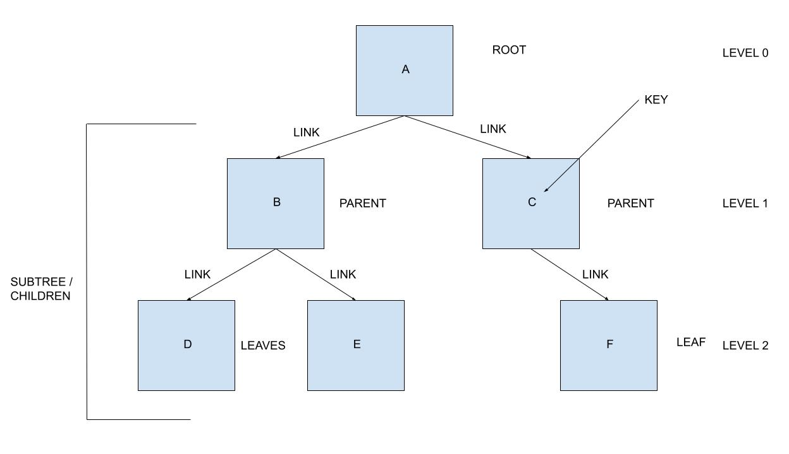
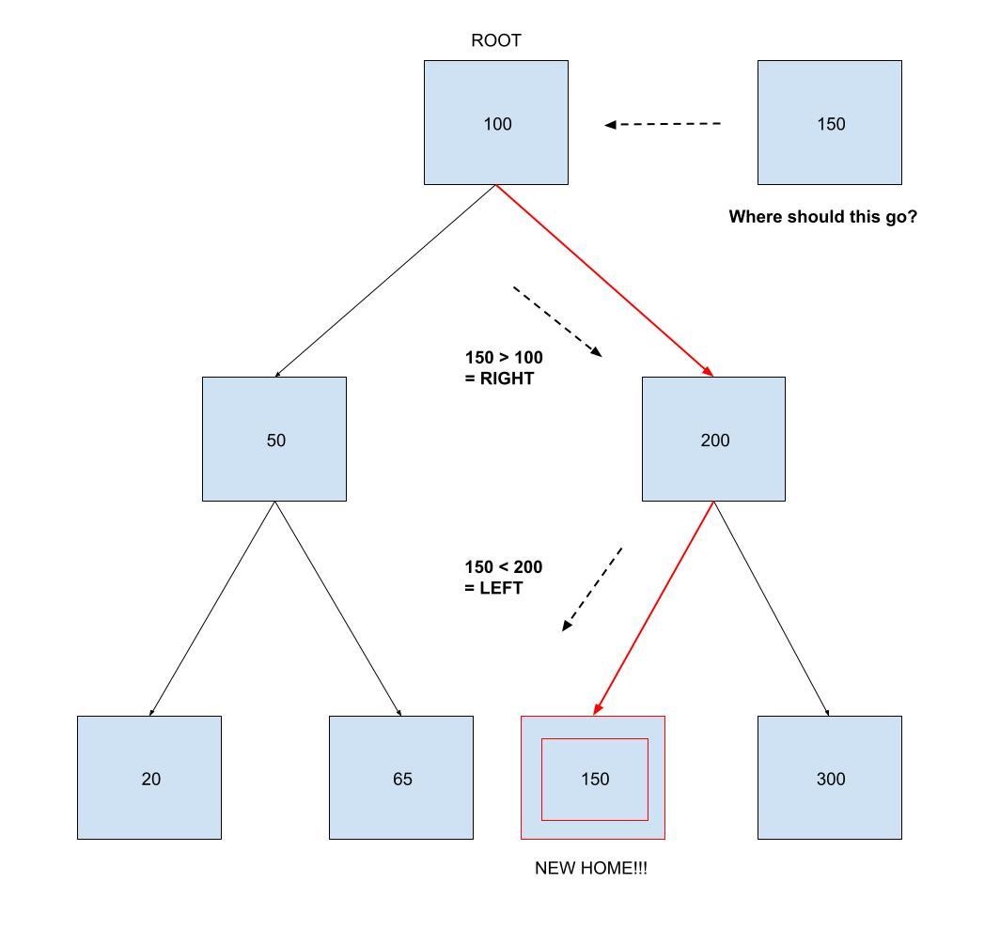
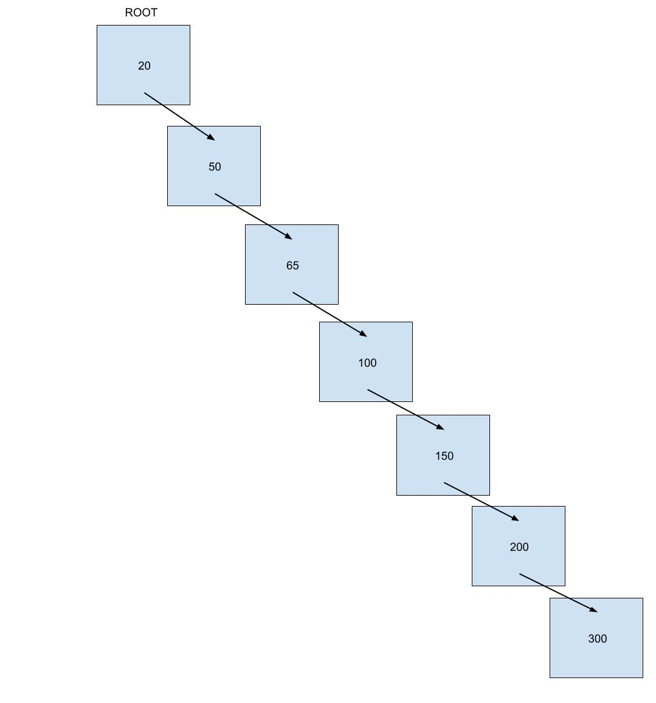
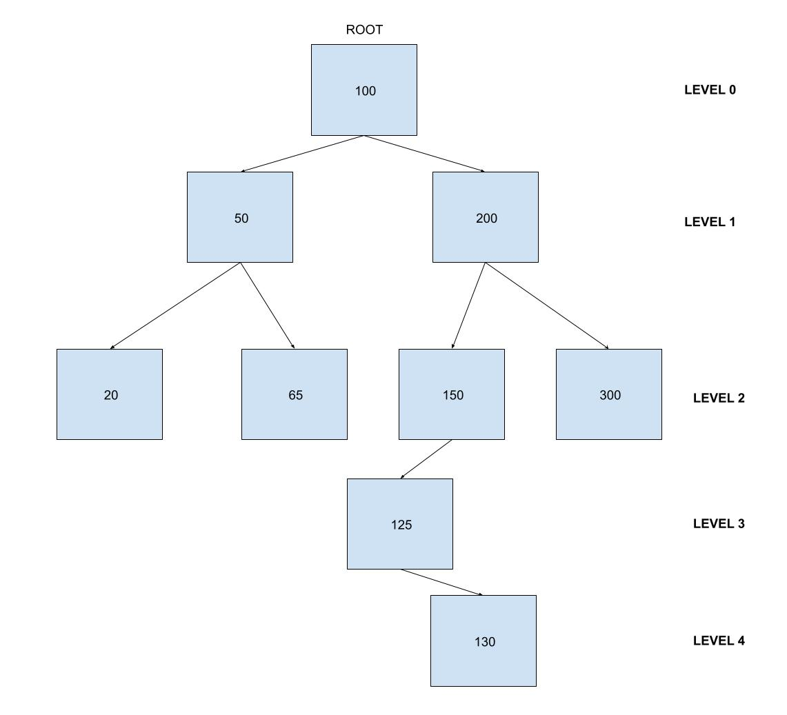
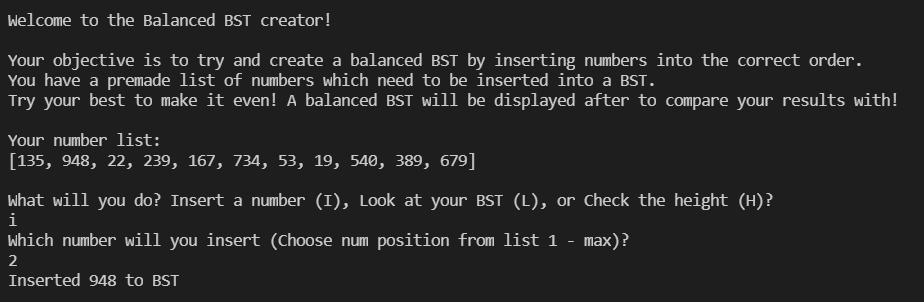
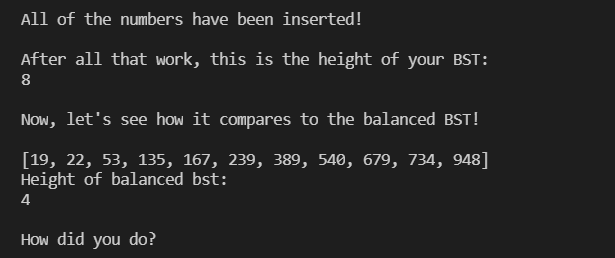

# Trees

## Introduction
It's hard to talk about data structures without including an excerpt on Trees, specifically Binary Search Trees (BSTs). The impressive thing about trees as data structures is that, when done correctly, trees can be used to store, organize, and retrieve data all at O(log n) efficiency! While we'll jump into conceptualization in just a moment to build a better picture of why this is, it is telling to point out that trees actually exist everywhere when it comes to item sortment, data compression, logic algorithms, record keeping, decision making, and everywhere else in programming. The unfortunate truth, however, is that most trees run undetected in the background of whatever program they are working in, so it's hard to realize they are there sometimes. While talking about trees might be a bit complicated at first, you'll be glad that you took the time to figure them out now!

In this section we will discuss BSTs, balancing trees, and how to use a tree data structure.

### Conceptualize
To be completely honest, there are dozens upon dozens of common variations of trees which each have their own type of specialty in computer programming. In order to build a better base in what a tree is, let's picture a common family tree for a moment! 


*Property of FreeFamilyTreeTemplates.com*

When we consider a family tree we usually picture a box, that represents yourself, with two lines that reach upwards towards your mom and dad. Following that are two more lines reaching back to your grandma and grandpa on your mother and father's side, and following that are even more family members! What you've just imagined is, what we can call, a Binary Tree where each box, or node/vertex, can have up to two links extending out from it. A tree, in general, is made up of these nodes which contain information inside of them. Connecting one node to a related node is a line we call a link/edge. By making a branching illustration for, in this case, our family relations we are able to easily record family names and how they relate to one another! On top of that, the information we just entered about our family is MUCH more organized than if we just stored all of these names into a LONG list of relatives. If we want to look up our mother's mother's father, for example, we know to follow the links from us to our mom, to our grandma, to our great grandfather! That just cut a 1/15 item search into a nearly direct reference to our location!

You may be thinking, "Hey, I have brothers and sisters and aunts and uncles too!" or, "My parents are divorced, so I don't even know my father's side of the family." Rest assured, not every tree is a Binary Tree. In fact, node can have as many connections in them as we want so long as we follow a pattern in which one node can be identified as the starting place or "Root" of the tree. While finding information in such graphs with m-number of links per node can be much trickier, keep in mind that a tree will always maintain a relationship similar to that of a real tree found in nature. All information originates from one place and branches out.


### Terminology
Now that we have an idea of what a tree is supposed to do, let's cover some of the basic terminology used in making trees! Some of the terms you'll need to be familiar with include:
1. Nodes
1. Roots
1. Parents
1. Children
1. Leaves
1. Subtrees
1. Degrees
1. Height
1. Keys

Beginning from the top-down: 

1. Nodes are any individual piece of information which we place into a tree.
1. Roots are a type of node which we declare as the "starting point" of a tree. Not all trees have a root and trees which have a rooted node are called "Rooted Trees." Roots have no parents and always exist on the first level of a tree.
1. When a node has connected nodes we call it a parent. In other words, one node gives birth to additional nodes and maintains a relation with them, making them a parent node.
1. As you already figured, parent nodes yield children nodes! A root node is not a child node because it doesn't have any parents.
1. When a child node doesn't have any further connections stemming from it, we call it a leaf. Another term for a leaf node is a "childless node" for obvious reasons.
1. While a tree may have a designated root from which everything spawns from, a subsection of the entire tree is called a subtree. Imagine zooming in on a branch of a large tree. In said zoomed in perspective, the beginning of the branch becomes the subtree of many more nodes and connections.
1. The number of links comming in and out of a node is that node's degree. In a Binary Tree, roots typically have a degree of two while parents may have a degree up to three. Leaves only have a degree of one.
1. The max level or depth of a tree is that tree's height. Height is important when considering the size of our tree and when trying to "balance" a tree.
1. The value contained within a node is called its key. These are vital for BST's to operate.

### BST Trees
Now that we understand what a tree is in general, let's focus our study on one type of tree, a "Binary Tree". What's fascinating, and extremely useful, about a binary tree is that each node is linked to no more than two other nodes (ignoring the ancestory link, of course). A binary tree begins with a rooted node which then gives "birth" to up to two child nodes. These nodes continue to produce children and form subtrees in and of themselves. When a certain branch terminates or, in other words, when a child fails to produce more children, the final node then becomes a leaf node. 



With this in mind, a "Binary Search Tree" (BST) is extremely useful to us, as programmers, because they follow rules of data usage which enable us to compare the value contained within nodes in our tree. That value stored inside each node is called the "Key," and rightfully so because that's the value which allows us to determine where to place new data entered into the graph. Typically, starting at the root, when a new node is being added to a BST we compare the value of the new node to the root. If the new node's key is "greater than" the root's key, then the value is placed to the right. If the new node's key is "less than" the root's key then it's placed to the left. This process continues from root to parent node to child node until the new node finds an empty spot to stay.



While trying to insert a new value in a linked list or into a normal array would be an O(n) example of efficiency, inserting into a "Balanced" tree, such as the one above, is an O(log n) operation. The reason being that the entire subtrees of information are being excluded from our search each time a comparison is made! We are drastically cutting down the amount of comparisons a normal array would have to make which enables us to, typically, get O(log n) efficiency. 

If a BST is unbalanced, however, we actually lose O(log n) efficiency and revert back towards O(n) efficiency! Now, what does it mean to be balanced and how can we make our trees balanced?

### Balancing Trees
Take a moment to consider how symmetrical and even the BST examples above appear. Each side has nearly the same amount of nodes and each subtree terminates at the same level. What would this tree look like if the wrong root was selected, causing it to become unbalanced?



Notice that this tree uses the exact same values as the balanced tree above but the wrong node was used and the nodes were entered in an increasing value order! When inserting all of the nodes in this order we get a lopsided graph which is horribly unbalanced. To be more specific, a tree is considered unbalanced when any one of its subtrees have a level difference of more than one from its surrounding subtrees. For example, this follow graph is also considered unbalanced.



While the "125" node is acceptable because it's within a 1 level range of the other subtrees in the BST, the "130" causes this graph to become unbalanced with its 2 level difference. 

The best solution for balancing a tree like this is to select a new parent node which can balance the tree out. Refering back to the example above, choosing "130" as a parent instead of "150" would cause the "125" node to be placed in level 3, left position and "150" node to be placed on level 3, right position. This would balance out our graph returning us to an O(log n) efficiency!

One way to determine if your tree is unbalanced when programming is to return the Height of each subtree and compare them to make sure they are within 1 level of each other.

### Traverse/Insert
Working with trees can be very useful in programming, but it can also get very complicated very fast if we're not careful. Two crucial operations to know when planning to use a BST are how to insert new information into a tree and then how to traverse a tree (usually in order to display the contents of a tree out). 

Starting with inserting, we must utilize a programming technique called "Recursion" in order to effectively search through the depths of a BST. Recursion is, in short, having a method call itself until a certain requirement is met. A simple example could counting up or down to ten:

```
def recursion_count(num):

    if num == 10:
        print("We have reached", num)
        return num
    
    if num > 10:
        print(num)
        recursion_count(num - 1)
    elif num < 10:
        print(num)
        recursion_count(num + 1)

recursion_count(2) # returns "2 3 4 5 6 7 8 9 We have reached 10"
recursion_count(15) # returns "15 14 13 12 11 We have reached 10"

```

This recursive method will continue to call itself and perform a given operation until the "Base Condition" is met and the program can escape itself. Simply put, our tree will utilize an insert method which will recursively compare the keys of the tree and then decide to go left or right. This recursion will continue until an empty space is found, then the to-be-inserted value will be entered there as a new node. Speaking of nodes, each node in a programmed BST will contain a key value, a left pointer, and a right pointer. Much like the linked list data structure, the pointer will keep track of the location of each node and will be used to determine if a space is occupied or empty in our tree.

Traversing a tree in order to print out or display the contents of a tree usually goes from smallest value to largest (left to right on a BST). Just like with inserting, we will use recursion to traverse down the left subtree of a node and then traverse right after that. In order to do this properly, we will use the Python command "yield" and "yield from" which works like a return statement in a function but without exiting or stopping the current operation. 

For more insight into how inserting and traversing a tree works, please refer to the coding examples included below!

### Other Operations
Some other operations which are possible to perform in a BST include removing nodes, searching for a particular value, determining the height of a node, and returning the size of a BST. Removing and searching operations are similar to inserting and traversing the BST in that you just compare every node, choosing to go left or right down the BST, until the value you are searching for is found. If found, remove it or return a "True" that it exists in the tree. In actuality, removing can be a little bit more complicated depending on if we want to simply eliminate the key value or if we want to disconnect the node entirely from our tree. If the node we are trying to remove has children, then removing will need to take that into consideration as well. Returning the height is also slightly more complicated as it requires one to traverse entire depth of the BST's left and right subtrees and then return the height of the longest one (plus 1 to account for the root). Lastly, the size of the BST is a value which is stored in the BST class used for initializing the data structure. This value can easily be returned upon request!

### Usages/Common Errors
As mentioned before, BST are extremely useful as data structures because they operate with O(log n) efficiency. 

One major error or misuse of BSTs is failing to create a tree which is balanced by choosing a poor root or inserting presorted data (for example, numbers in increasing/decreasing order). Doing so will reduce the effectiveness of your BST to that of a normal list or array. Be sure to double check the height of your tree's subtrees to ensure that your tree is configured the best way it can be! We will write an example solution for generating a balanced BST from a list of values in our practice below.

Also, be careful when using recursion to always include a Base Condition into the method. Failing to do so will cause your method to recurse itself to death by reaching the Python recursion limit. 

## Rock Picking Sorting Tree Example

This code demonstrates the uses of a Binary Search Tree to organize and quickly reference data by inserting into,
traversing through, and referencing items found in a BST. To be completely honest, this code is rather silly because a BST
is most effective when having to deal with a LOT of information because of its efficiency at referencing data. However,
this simple example focuses on how to get inserting, searching, and traversing to work using BSTs.

Requirements:

1. Initialize the BST class and create a root node with base value of None
1. Be able to insert new items into the BST and don't allow duplicates
1. Be able to check contents of BST to see if a certain item exists in the tree
1. Traverse through the tree and print out its contents from left to right
1. Use the search feature to check if we have the required items in our BST to beat the game


```
"""
Rock Picking BST Example
Author: Benjamin Fernelius

"""

import random

class BST: # Create a BST

    class Node: # Keep track of nodes

        def __init__(self, data):

            self.data = data
            self.left = None
            self.right = None
    
    def __init__(self): # set the root to none to begin

        self.root = None

    def insert(self, data): # control inserting data
        
        if self.root is None:
            self.root = BST.Node(data)
        else:
            self.recurse_insert(data, self.root)
    
    def recurse_insert(self, data, node): # recurse to find empty spot

        if data == node.data:
            pass
        elif data < node.data:
            if node.left is None:
                node.left = BST.Node(data)
            else:
                self.recurse_insert(data, node.left)
        else:
            if node.right is None:
                node.right = BST.Node(data)
            else:
                self.recurse_insert(data, node.right)
    
    def __contains__(self, data): # searches data in tree to see if ~~~~ data exists in it already
        if self.root == None:
            pass
        else:
            return self.recurse_contains(data, self.root)

    def recurse_contains(self, data, node): # done using recursion

        if data == node.data:
            return True
        elif data < node.data:
            if node.left is None:
                return False
            else:
                return self.recurse_contains(data, node.left)
        else:
            if node.right is None:
                return False
            else:
                return self.recurse_contains(data, node.right)


    def __iter__(self): # traverse and display contents of tree in order

        yield from self.traverse(self.root)
    
    def traverse(self, node): # recurse through tree from left to right
        
        if node is not None:
            yield from self.traverse(node.left)
            yield node.data
            yield from self.traverse(node.right)


def stone_pickup(): # return a stone
    stones = ["Red Stone", "Blue Stone", "Green Stone", "Yellow Stone", "Purple Stone", "Nothing"]

    return stones[random.randint(0, len(stones) - 1)]

def main(): 
    game_on = True
    red = False
    blue = False
    green = False
    yellow = False
    purple = False

    inv_manager = BST()
    print("\nWelcome to our silly rock picking up game!\n")
    print("You find yourself stuck in an enclosed area and find a door with 5 slots in it.")
    print("In order to open the door to escape, you must find one of each type of rock in your surroundings:")
    print("A Red, Green, Blue, Yellow, and Purple rock.\n")
    print("Start searching!\n")

    while game_on:
        answer = input("What will you do? Search for rocks (S), Try the door (T), or Look at your inventory (L)?\n")

        if answer.upper() == "S":
            print("You rustle through some bushes and find: ")
            draw = stone_pickup()
            if draw == "Nothing":
                print("Nothing... Try again in another bush.\n")
            elif draw in inv_manager:
                print(f"Another {draw}... Let's toss this and try again!\n")
            else:
                print(f"A {draw}! Let's add it to our bag.\n")
                inv_manager.insert(draw)
        elif answer.upper() == "T":
            print("You walk up to the door and try to see if you can open it.\n")
            if "Red Stone" in inv_manager:
                red = True
                print("You insert the Red Stone\n")
            else:
                print("You are missing the Red Stone!\n")
            if "Blue Stone" in inv_manager:
                blue = True
                print("You insert the Blue Stone\n")
            else:
                print("You are missing the Blue Stone!\n")
            if "Green Stone" in inv_manager:
                green = True
                print("You insert the Green Stone\n")
            else:
                print("You are missing the Gree Stone!\n")
            if "Yellow Stone" in inv_manager:
                yellow = True
                print("You insert the Yellow Stone\n")
            else:
                print("You are missing the Yellow Stone!\n")
            if "Purple Stone"in inv_manager:
                purple = True
                print("You insert the Purple Stone\n")
            else:
                print("You are missing the Purple Stone!\n")
            if red and blue and green and yellow and purple:
                print("The door swings open and you run free. Nice job!\n")
                game_on = False
            else:
                print("Looks like you'll need to do a bit more searching!\n")
        elif answer.upper() == "L":
            print("You have the following items in your bag: ")
            for item in inv_manager:
                print(item)
            print()
        else:
            print("*You twiddle your thumbs back and forth for a while*")
            print("Maybe I should do something...\n")


if __name__ == "__main__":
    main()
```

Link to the runable python file: [BST Example](bst_example_1.py)

## Item Sorting Practice Example

Write a program which can be used to check the height of your BST while you are inserting more and more items into it. Additionally, feel free to use the Balanced BST method to check the height of the BST you create versus a balanced BST. Be sure to use recursion when navigating the height method in order to each each subtree for it's height and then compare each subtree's height to each other to determine the max height. Note, feel free to use the BST class in the previous example as well.

Requirements:

1. Have a working BST tree
1. Build a get_height method to check the height of your BST
1. Enable the user to add numbers to a BST tree to simulate populating a BST tree in a real-life scenario
1. Allow the user to check their height, traverse the content of their BST, and insert new data
1. Use the Balanced BST method (if you want) to allow the user to compare their BST tree with a balanced one

Feel free to use this code as a frame and the BST class above for help.

```
def get_height(self):

    if self.root is None:
        return 0
    else:
        result_left = self.recurse_height(self.root)
        result_right = self.recurse_height(self.root, result_left)

        if result_left > result_right:
            return result_left
        else:
            return result_right

def recurse_height(self, node, result_left=None, count=0):
    
    # Enter your code here!
    
def create_balanced_bst(list):
    
    bst = BST()
    recurse_middle(list, 0, len(list) - 1, bst)
    return bst

def recurse_middle(list, first, last, bst):

    if len(list) != 0:
        halfway = (first + last) // 2
        if bst.root == None:
            bst.insert(list[halfway])
            recurse_middle(list, first, halfway, bst)
            recurse_middle(list, halfway + 1, last, bst)
        else:
            if list[halfway] in bst:
                pass
            else:
                bst.insert(list[halfway])
                recurse_middle(list, first, halfway, bst)
                recurse_middle(list, halfway + 1, last, bst)

def main():
    game_on = True

    while game_on:
        pass
```

Here is an image of what the terminal output may look like:




### Solution Link


Feel free to compare your code with this example solution here: [Solution](bst_student_example.py)

[Return to welcome page](0-welcome.md)